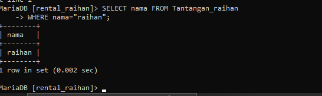
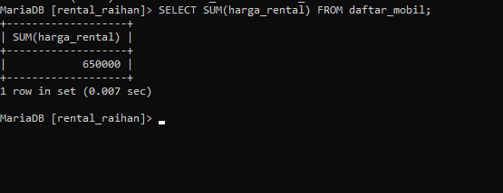

# Tabel desc_mobil

```mysql
+--------------+-------------+------+-----+---------+-------+
| Field        | Type        | Null | Key | Default | Extra |
+--------------+-------------+------+-----+---------+-------+
| id_mobil     | int(2)      | NO   | PRI | NULL    |       |
| no_plat      | varchar(18) | NO   | UNI | NULL    |       |
| no_mesin     | varchar(18) | NO   | UNI | NULL    |       |
| warna        | varchar(18) | NO   |     | NULL    |       |
| pemilik      | varchar(18) | NO   |     | NULL    |       |
| peminjam     | varchar(18) | YES  |     | NULL    |       |
| harga_rental | int(18)     | YES  |     | NULL    |       |
+--------------+-------------+------+-----+---------+-------+
7 rows in set (0.014 sec)
```


# Select And

## Struktur Query
```mysql
select nama_kolom,nama_kolom from nama_tabel where nama_kolom="nilai_kolom 1" and nama_kolom='nilai_kolom 2'
```
## Contoh
```mysql
select warna,pemilik from mobil where warna="HITAM" and pemilik='Ibrahim'
```
### Hasil
**setelah kamu mengetikkan query diatas selanjutnya klik enter  maka akan muncul tampilan seperti yang di bawah ini yang berarti kamu telah berhasil:**

### Analisis
analisis kode Query 
SELECT warna, pemilik: Bagian ini menentukan kolom-kolom yang akan diambil dari tabel. Dalam hal ini, kolom "warna" dan "pemilik" akan diambil dari tabel "mobil".

FROM mobil: Bagian ini menentukan tabel dari mana data akan diambil, yaitu tabel "mobil".

WHERE warna="HITAM" AND pemilik='Ibrahim': Bagian ini menetapkan kondisi yang harus dipenuhi oleh baris-baris yang diambil. Hanya baris-baris di mana nilai kolom "warna" adalah "HITAM" dan nilai kolom "pemilik" adalah 'Ibrahim' yang akan diambil.

Pemilihan Kolom: Query ini memilih dua kolom dari tabel mobil, yaitu warna dan pemilik.

Kondisi Seleksi: Query ini menggunakan klausa WHERE dengan dua kondisi:

warna="HITAM": Memilih hanya baris-baris di mana warna mobil adalah "HITAM".
pemilik='Ibrahim': Memilih hanya baris-baris di mana pemilik mobil adalah "Ibrahim".

Penggunaan Operator AND: Kondisi AND memastikan bahwa hanya baris yang memenuhi kedua kondisi tersebut akan dipilih. Artinya, hanya mobil yang berwarna hitam dan dimiliki oleh Ibrahim yang akan dimasukkan dalam hasil query.

Hasil Query: Hasil query ini akan menampilkan daftar mobil yang berwarna hitam dan dimiliki oleh Ibrahim, termasuk informasi tentang warna (selalu "HITAM") dan pemilik (selalu "Ibrahim").

Tujuan: Tujuan dari query ini adalah untuk mengidentifikasi mobil-mobil dengan kriteria spesifik (warna hitam dan pemilik Ibrahim). Ini bisa digunakan untuk analisis data, pelaporan, atau kebutuhan informasi spesifik terkait mobil-mobil tersebut.


### Kesimpulan
Perintah SQL di atas merupakan sebuah query yang digunakan untuk mengambil data dari tabel `'mobil'`. Query tersebut memiliki dua kondisi pencarian, yaitu warna mobil yang harus sama dengan `"HITAM"` dan pemilik mobil yang harus sama dengan `"Ibrahim".` Dalam query tersebut, dipilih dua kolom yaitu `'warna'` dan `'pemilik'.` Jadi, hasil dari query tersebut akan menampilkan semua mobil dengan warna hitam yang dimiliki oleh seseorang dengan nama Ibrahim.
# Select OR

## Struktur Query
```mysql
select nama_kolom,nama_kolom from nama_tabel where warna='nilai_kolom 1' or nama_kolom='nilai_kolom 2';
```
## Contoh
```mysql
select warna,pemilik from mobil where warna='HITAM' or pemilik='ibrahim';
```
### Hasil
**setelah kamu mengetikkan query diatas selanjutnya klik enter  maka akan muncul tampilan seperti yang di bawah ini yang berarti kamu telah berhasil:**


### Analisis
1. Mengambil data mobil dengan warna `"HITAM".`
2. Mengambil data mobil yang dimiliki oleh seseorang dengan nama "Ibrahim". 

    Ketika salah satu kondisi atau kedua kondisi tersebut terpenuhi, data akan dipilih. Setelah itu, query tersebut memilih dua kolom, yaitu `'warna'` dan `'pemilik'`, dari tabel `'mobil'`. Jadi, hasil dari query tersebut akan menampilkan semua mobil dengan warna hitam dan semua mobil yang dimiliki oleh seseorang dengan nama `"Ibrahim"`.
### Kesimpulan
Query MySQL di atas mengambil data dari tabel `'mobil'` dengan dua kondisi pencarian:

1. Mobil dengan warna `"HITAM"`.
2. Mobil yang dimiliki oleh seseorang dengan nama `"Ibrahim"`.
    Kondisi-kondisi tersebut dipisahkan dengan operator OR, yang berarti data akan dipilih jika salah satu atau kedua kondisi terpenuhi. Setelah itu, query memilih dua kolom, yaitu `'warna'` dan `'pemilik'`, dari tabel 'mobil'. Kesimpulannya, hasil dari query tersebut akan menampilkan semua mobil dengan warna hitam dan semua mobil yang dimiliki oleh seseorang dengan nama "Ibrahim".


# Select Between

## Struktur Query
```mysql
select * from nama_tabel where nama_kolom between Nilai_kolom 1 and nilai_kolom 2;
```
## Contoh
```mysql
select * from mobil where harga_rental between 100000 and 200000;
```
### Hasil
**setelah kamu mengetikkan query diatas selanjutnya klik enter  maka akan muncul tampilan seperti yang di bawah ini yang berarti kamu telah berhasil:**

### Analisis
Query MySQL di atas digunakan untuk mengambil data dari tabel 'mobil' dengan kondisi pencarian menggunakan klausa BETWEEN untuk kolom 'harga_rental'. Klausa BETWEEN digunakan untuk menentukan rentang nilai yang akan dicari.


-  SELECT *: Mengambil semua kolom dari tabel 'mobil'.
-  FROM mobil: Menentukan tabel yang akan diambil datanya, yaitu 'mobil'.
-  WHERE harga_rental BETWEEN 100000 AND 200000: Menentukan kondisi pencarian dimana harga_rental harus berada dalam rentang antara 100,000 dan 200,000.

Jadi, hasil dari query ini akan menampilkan semua data mobil yang memiliki harga rental di antara 100,000 dan 200,000.
### Kesimpulan
Query MySQL di atas mengambil semua data dari tabel 'mobil' dimana harga rental mobil berada dalam rentang antara 100,000 dan 200,000. Ini berarti query tersebut akan menghasilkan daftar semua mobil yang memiliki harga rental antara 100,000 dan 200,000.
# Select Not Between

## Struktur Query
```mysql
select * from nama_tabel where nama_kolom Not Between Nilai_kolom 1 and nilai_kolom 2;

```
## Contoh
```mysql
select * from mobil where harga_rental not between 100000 and 200000;
```
### Hasil
**setelah kamu mengetikkan query diatas selanjutnya klik enter  maka akan muncul tampilan seperti yang di bawah ini yang berarti kamu telah berhasil:**

### Analisis
Query MySQL di atas digunakan untuk mengambil data dari tabel 'mobil' dengan kondisi pencarian menggunakan klausa NOT BETWEEN untuk kolom 'harga_rental'. Klausa NOT BETWEEN digunakan untuk mengecualikan rentang nilai yang akan dicari.


**Adapun poin" yang dapat saya ambil adalah :**
-  SELECT *: Mengambil semua kolom dari tabel 'mobil'.
-  FROM mobil: Menentukan tabel yang akan diambil datanya, yaitu 'mobil'.
-  WHERE harga_rental NOT BETWEEN 100000 AND 200000: Menentukan kondisi pencarian dimana harga_rental tidak berada dalam rentang antara 100,000 dan 200,000.

Jadi, hasil dari query ini akan menampilkan semua data mobil yang memiliki harga rental diluar rentang antara 100,000 dan 200,000.
### Kesimpulan
Query MySQL di atas digunakan untuk mengambil semua data dari tabel 'mobil' dimana harga rental mobil tidak berada dalam rentang antara 100,000 dan 200,000. Dengan kata lain, query tersebut akan menampilkan semua mobil yang memiliki harga rental di luar rentang tersebut.
# Select <=

## Struktur Query
```mysql
select * from nama_tabel where nama_kolom <=nilai_kolom 1;
```
## Contoh
```mysql
select * from mobil where harga_rental <=50000;
```
### Hasil
**setelah kamu mengetikkan query diatas selanjutnya klik enter  maka akan muncul tampilan seperti yang di bawah ini yang berarti kamu telah berhasil:**

### Analisis
Query MySQL di atas digunakan untuk mengambil data dari tabel 'mobil' dengan kondisi pencarian dimana harga rental mobil kurang dari atau sama dengan 50,000.

**Adapun poin" yang dapat saya ambil adalah :**
- SELECT *: Mengambil semua kolom dari tabel 'mobil'.
- FROM mobil: Menentukan tabel yang akan diambil datanya, yaitu 'mobil'.
-  WHERE harga_rental <= 50000: Menentukan kondisi pencarian dimana harga_rental mobil harus kurang dari atau sama dengan 50,000.

Jadi, hasil dari query ini akan menampilkan semua data mobil yang memiliki harga rental kurang dari atau sama dengan 50,000.
### Kesimpulan
Query MySQL di atas digunakan untuk mengambil semua data dari tabel 'mobil' dimana harga rental mobil kurang dari atau sama dengan 50,000. Ini berarti query tersebut akan menghasilkan daftar semua mobil yang memiliki harga rental kurang dari atau sama dengan 50,000.

# Select >=

## Struktur Query
```mysql
select * from nama_tabel where nama_kolom >=nilai_kolom 1;
```
## Contoh
```mysql
select * from mobil where harga_rental >=50000;
```
### Hasil
**setelah kamu mengetikkan query diatas selanjutnya klik enter  maka akan muncul tampilan seperti yang di bawah ini yang berarti kamu telah berhasil:**

### Analisis
Query MySQL di atas digunakan untuk mengambil data dari tabel 'mobil' dengan kondisi pencarian dimana harga rental mobil lebih besar dari atau sama dengan 50,000.

**Adapun poin" yang dapat saya ambil adalah :**
- SELECT *: Mengambil semua kolom dari tabel 'mobil'.
- FROM mobil: Menentukan tabel yang akan diambil datanya, yaitu 'mobil'.
- WHERE harga_rental >= 50000: Menentukan kondisi pencarian dimana harga_rental mobil harus lebih besar dari atau sama dengan 50,000.

Jadi, hasil dari query ini akan menampilkan semua data mobil yang memiliki harga rental lebih besar dari atau sama dengan 50,000.
### Kesimpulan
Query MySQL di atas digunakan untuk mengambil semua data dari tabel 'mobil' dimana harga rental mobil lebih besar dari atau sama dengan 50,000. Ini berarti query tersebut akan menghasilkan daftar semua mobil yang memiliki harga rental lebih besar dari atau sama dengan 50,000.
# Select <> atau !=

## Struktur Query
```mysql
select * from nama_tabel where nama_kolom <>nilai_kolom 1;
```
## Contoh 
```mysql
select * from mobil where harga_rental <>50000;
```

### Hasil
**setelah kamu mengetikkan query diatas selanjutnya klik enter  maka akan muncul tampilan seperti yang di bawah ini yang berarti kamu telah berhasil:**


### Analisis
Query MySQL di atas digunakan untuk mengambil data dari tabel 'mobil' dengan kondisi pencarian dimana harga rental mobil tidak sama dengan 50,000.

**Adapun poin" yang dapat saya ambil adalah :**
- SELECT *: Mengambil semua kolom dari tabel 'mobil'.
- FROM mobil: Menentukan tabel yang akan diambil datanya, yaitu 'mobil'.
- WHERE harga_rental <> 50000: Menentukan kondisi pencarian dimana harga_rental mobil tidak sama dengan 50,000.

Jadi, hasil dari query ini akan menampilkan semua data mobil yang memiliki harga rental yang tidak sama dengan 50,000.
### Kesimpulan
Query MySQL di atas digunakan untuk mengambil semua data dari tabel 'mobil' dimana harga rental mobil tidak sama dengan 50,000. Ini berarti query tersebut akan menghasilkan daftar semua mobil yang memiliki harga rental yang berbeda dari 50,000.

# Tantangan login

## Penjelasan

`SELECT nama FROM tantangan` : merupakan perintah SQL untuk mencari kolom nama yang berada di tabel tantangan.

`WHERE nama= "raihan" : query SQL untuk mencari keberadaan data yang bernama "raihan" yang berada di dalam kolom `nama`.

## Query

```mysql

SELECT nama FROM tantangan

    -> WHERE nama="REZKY AWALYA";

```

## Hasil



## Kesimpulan
query MySQL "SELECT nama FROM tantangan WHERE nama='raihan';" digunakan untuk memilih nama dari tabel `tantangan` di mana nilainya sama dengan "raihan". Ini merupakan contoh penggunaan klausa `WHERE` untuk melakukan filtrasi data berdasarkan kriteria tertentu. Hasilnya akan berupa nama dari baris-baris yang memenuhi kondisi yang ditentukan. 
# Select  IN

## Struktur Query
```mysql
 select * from nama_tabel where nama_kolom in ('nilai_kolom 2','nilai_kolom 1');
```
## Contoh
```mysql
 select * from mobil where warna in ('silver','merah');
```
### Hasil
**setelah kamu mengetikkan query diatas selanjutnya klik enter  maka akan muncul tampilan seperti yang di bawah ini yang berarti kamu telah berhasil:**

### Analisis
Query MySQL di atas digunakan untuk mengambil data dari tabel 'mobil' dengan kondisi pencarian dimana warna mobil adalah 'silver' atau 'merah'.

berikut analisis Query yang ada di select IN

**Adapun poin" yang dapat saya ambil adalah :**
1. SELECT *: Mengambil semua kolom dari tabel 'mobil'.
2. FROM mobil: Menentukan tabel yang akan diambil datanya, yaitu 'mobil'.
3. WHERE warna IN ('silver', 'merah'): Menentukan kondisi pencarian dimana warna mobil harus 'silver' atau 'merah'.

Jadi, hasil dari query ini akan menampilkan semua data mobil yang memiliki warna 'silver' atau 'merah'.
### Kesimpulan
Query MySQL di atas digunakan untuk mengambil semua data dari tabel 'mobil' dimana warna mobil adalah 'silver' atau 'merah'. Ini berarti query tersebut akan menghasilkan daftar semua mobil yang memiliki warna 'silver' atau 'merah'.
# Select IN+AND

## Struktur Query
```mysql 
 select * from nama_tabel
     where nama_kolom in ('nilai_kolom 1', 'nilai_kolom 2')
     and nama_kolom =nilai_kolom;
```
## Contoh 
```mysql
 select * from mobil
     where warna in ('HIAM', 'SILVER')
     and harga_rental =50000;
```
### Hasil
**setelah kamu mengetikkan query diatas selanjutnya klik enter  maka akan muncul tampilan seperti yang di bawah ini yang berarti kamu telah berhasil:**

### Analisis
Query MySQL di atas digunakan untuk mengambil data dari tabel 'mobil' dengan dua kondisi pencarian:

-  Warna mobil harus 'HITAM' atau 'SILVER'.
- Harga rental mobil harus sama dengan 50,000.

**Adapun poin" yang dapat saya ambil adalah :**
-  SELECT *: Mengambil semua kolom dari tabel 'mobil'.
-  FROM mobil: Menentukan tabel yang akan diambil datanya, yaitu 'mobil'.
-  WHERE warna IN ('HITAM', 'SILVER'): Menentukan kondisi pencarian dimana warna mobil harus 'HITAM' atau 'SILVER'.
-  AND harga_rental = 50000: Menentukan kondisi pencarian dimana harga rental mobil harus sama dengan 50,000.

Jadi, hasil dari query ini akan menampilkan semua data mobil yang memiliki warna 'HITAM' atau 'SILVER', dan harga rental mobil adalah 50,000.
### Kesimpulan
Query MySQL di atas digunakan untuk mengambil semua data dari tabel 'mobil' dimana warna mobil adalah 'HITAM' atau 'SILVER', dan harga rental mobil adalah 50,000. Ini berarti query tersebut akan menghasilkan daftar semua mobil yang memiliki warna 'HITAM' atau 'SILVER', dan harga rental mobil adalah 50,000.

# Select IN+OR

## Struktur Query
```mysql
 select * from nama_tabel
     where nama_kolom in ('nilai_kolom 1', 'nilai_kolom 2')
     or nama_kolom =nilai_kolom;
```
## Contoh 
```mysql
 select * from mobil
    where warna in ('HIAM', 'SILVER')
    or harga_rental =50000;
```
### Hasil
**setelah kamu mengetikkan query diatas selanjutnya klik enter  maka akan muncul tampilan seperti yang di bawah ini yang berarti kamu telah berhasil:**

### Analisis
Query MySQL di atas digunakan untuk mengambil data dari tabel 'mobil' dengan dua kondisi pencarian:

1. Warna mobil harus 'HITAM' atau 'SILVER'.
2. Harga rental mobil harus sama dengan 50,000.

**Adapun poin" yang dapat saya ambil adalah :**
1. SELECT *: Mengambil semua kolom dari tabel 'mobil'.
2. FROM mobil: Menentukan tabel yang akan diambil datanya, yaitu 'mobil'.
3. WHERE warna IN ('HITAM', 'SILVER'): Menentukan kondisi pencarian dimana warna mobil harus 'HITAM' atau 'SILVER'.
4. OR harga_rental = 50000: Menentukan kondisi pencarian dimana harga rental mobil harus sama dengan 50,000.

Jadi, hasil dari query ini akan menampilkan semua data mobil yang memiliki warna 'HITAM' atau 'SILVER', serta semua mobil yang memiliki harga rental 50,000.
### Kesimpulan
Query MySQL di atas digunakan untuk mengambil semua data dari tabel '`mobil`' dimana warna mobil adalah '`HITAM`' atau '`SILVER`', atau harga rental mobil adalah `50,000.` Ini berarti query tersebut akan menghasilkan daftar semua mobil yang memiliki warna `'HITAM'` atau `'SILVER'`, serta semua `mobil` yang memiliki harga rental `50,000.`
# Select IN+AND+OPERATOR

## Struktur Query
```mysql
select * from mobil
     where warna in ('hitam','silver')
     AND harga_rental > 50000;
```

```mysql
select * from mobil
     where warna in ('hitam','silver')
     AND harga_rental <100000;
```
## Contoh
1. 
```mysql
select * from mobil
     where warna in ('hitam','silver')
     AND harga_rental > 50000;
```

```mysql
select * from mobil
     where warna in ('hitam','silver')
     AND harga_rental <100000;
```

## Hasil
setelah kamu mengetikkan query diatas selanjutnya klik enter  maka akan muncul tampilan seperti yang di bawah ini yang berarti kamu telah berhasil:


## Analisis
Query MySQL pertama digunakan untuk mengambil data dari tabel 'mobil' dengan dua kondisi pencarian:

1. Warna mobil harus '`HITAM`' atau '`SILVER`'.
2. Harga rental mobil harus kurang dari `100,000.`

Berikut Poin-poin  penting dari analisis saya:
1. SELECT *: Mengambil semua kolom dari tabel 'mobil'.
2. FROM mobil: Menentukan tabel yang akan diambil datanya, yaitu 'mobil'.
3. WHERE warna IN ('`hitam`', '`silver`'): Menentukan kondisi pencarian dimana warna mobil harus 'hitam' atau '`silver`'.
4. AND harga_rental < `100000:` Menentukan kondisi pencarian dimana harga rental mobil harus kurang dari `100,000.`

 
## Kesimpulan
 Query MySQL pertama mengambil data mobil dengan warna 'hitam' atau 'silver' dan harga rental kurang dari 100,000. Query kedua mengambil data mobil dengan warna 'hitam' atau 'silver' dan harga rental lebih besar dari 50,000. 

Kesimpulannya, query pertama akan menghasilkan daftar mobil 'hitam' atau 'silver' dengan harga rental di bawah 100,000, sedangkan query kedua akan menghasilkan daftar mobil 'hitam' atau 'silver' dengan harga rental di atas 50,000.

# Select Like Mencari Awalan

## Struktur
```mysql
select * from nama_tabel
     where nama_kolom like "nilai_kolom";

```
## Contoh Query
```mysql
 select * from mobil
     where pemilik like "ib%";
```
## Hasil
setelah kamu mengetikkan query diatas selanjutnya klik enter  maka akan muncul tampilan seperti yang di bawah ini yang berarti kamu telah berhasil:

## Analisis
Select like berikut ini berfungsing untuk mencari semua data dari tabel "mobil" di mana kolom pemilik dimulai dengan awalan 'ib'. 

SELECT * FROM mobil: Ini adalah pernyataan SELECT yang memilih semua kolom dari tabel 'mobil'.

WHERE pemilik LIKE 'ib%': Ini adalah klausa WHERE yang digunakan untuk memfilter baris berdasarkan kondisi tertentu. Kondisi di sini adalah bahwa nilai kolom 'pemilik' harus dimulai dengan awalan 'ib'.
## Kesimpulan
jadi kesimpulannnya adalah pengguna dapat di permudah untuk mencari suatu kolom dengan menggunakan query tersebut 

# Select Like Mencari Akhiran

## Struktur
```mysql
select * from nama_tabel
     where nama_kolom like "nilai_kolom";
```
## Contoh Query
```mysql
 select * from mobil
    where pemilik like "%m";
```
## Hasil
setelah kamu mengetikkan query diatas selanjutnya klik enter  maka akan muncul tampilan seperti yang di bawah ini yang berarti kamu telah berhasil:

## Analisis
sama seperti select di atas namun perbedaannya Query tersebut mencari semua data dari tabel "mobil" di mana kolom pemilik dimulai dengan akhiran 'm'.

SELECT * FROM mobil: Ini adalah pernyataan SELECT yang memilih semua kolom dari tabel 'mobil'.

WHERE pemilik LIKE '%m': Ini adalah klausa WHERE yang digunakan untuk memfilter baris berdasarkan kondisi tertentu. Kondisi di sini adalah bahwa nilai kolom 'pemilik' harus Akhiran dengan awalan 'm'.

## Kesimpulan
- Program ini akan mengembalikan semua baris dari tabel "`mobil`" di mana nilai dalam kolom "pemilik" diakhiri dengan huruf '`m`'. Karakter apa pun dapat muncul sebelum huruf '`m`' karena wildcard '`%`' akan cocok dengan nol atau lebih karakter sebelumnya. 

# Select Like Mencari Awalan & Akhiran

## Struktur
```mysql
select * from nama_tabel
     where nama_kolom like "nilai_kolom";

```
## Contoh Query
```mysql
 select * from mobil
     where pemilik like "b%m";
```
## Hasil
setelah kamu mengetikkan query diatas selanjutnya klik enter  maka akan muncul tampilan seperti yang di bawah ini yang berarti kamu telah berhasil:

## Analisis
1. SELECT * FROM mobil`: Perintah ini memilih semua kolom dari tabel  bernama "mobil". 
2. `WHERE pemilik LIKE 'b%m'`: Ini adalah klausul WHERE yang digunakan untuk memfilter baris berdasarkan pola tertentu di dalam kolom "pemilik". 
- `pemilik`: Merupakan nama kolom yang akan diperiksa. - `LIKE`: Operator ini digunakan untuk mencocokkan nilai kolom dengan pola tertentu. 
- `'b%m'`: Ini adalah pola yang ingin dicocokkan. 
- `'b'`: Menyatakan bahwa nilai harus diawali dengan huruf '`b`'. 
- `'%'`: Adalah wildcard yang cocok dengan nol atau lebih karakter apa pun.
- `'m'`: Menyatakan bahwa nilai harus diakhiri dengan huruf '`m`'.

## Kesimpulan
Program ini akan mengembalikan semua baris dari tabel "mobil" di mana nilai dalam kolom "pemilik" dimulai dengan huruf '`b`' dan diakhiri dengan huruf '`m`', dengan jumlah karakter apa pun di antaranya. 


# select like mencari berdasarkan total kerakter

## Struktur
```mysql
select * from nama_tabel
     where nama_kolom like "nilai_kolom";

```

```mysql
select * from nama_tabel
     where nama_kolom like "nilai_kolom";

```
## Contoh Query
```mysql
select * from mobil
where pemilik like 'i__';
```

```mysql
select * from mobil
  where pemilik like '____';
```
## Hasil
setelah kamu mengetikkan query diatas selanjutnya klik enter  maka akan muncul tampilan seperti yang di bawah ini yang berarti kamu telah berhasil:


## Analisis
1. `SELECT * FROM mobil`: Perintah ini memilih semua kolom dari tabel bernama "mobil".
    
2. `WHERE pemilik LIKE 'i__'`: Ini adalah klausul WHERE yang digunakan untuk menentukan baris berdasarkan pola tertentu di dalam kolom "pemilik".
    
    - `pemilik`: Merupakan nama kolom yang akan diperiksa.
    - `LIKE`: Operator ini digunakan untuk mencocokkan nilai kolom dengan pola tertentu.
    - `'i__'`: Ini adalah pola yang ingin dicocokkan.
        - `'i'`: Menyatakan bahwa nilai harus dimulai dengan huruf 'i'.
        - `'__'`: Adalah wildcard yang cocok dengan tepat dua karakter setelah huruf 'i'.
## Analisis
1. `SELECT * FROM mobil`: Perintah ini memilih semua kolom dari tabel bernama "mobil".
    
2. `WHERE pemilik LIKE '____'`: Ini adalah klausul WHERE yang digunakan untuk memfilter baris berdasarkan pola tertentu di dalam kolom "pemilik".
    
    - `pemilik`: Merupakan nama kolom yang akan diperiksa.
    - `LIKE`: Operator ini digunakan untuk mencocokkan nilai kolom dengan pola tertentu.
    - `'____'`: Ini adalah pola yang ingin dicocokkan.
        - `'____'`: Adalah wildcard yang cocok dengan tepat empat karakter.
## Kesimpulan
- Program ini akan mengembalikan semua baris dari tabel "mobil" di mana nilai dalam kolom "pemilik" dimulai dengan huruf '`i`' dan terdiri dari dua karakter tambahan setelahnya. Wildcard `__` akan cocok dengan dua karakter apa pun di posisi tersebut.

## Kesimpulan
- Program ini akan mengembalikan semua baris dari tabel "mobil" di mana nilai dalam kolom "pemilik" terdiri tepat dari empat karakter.
# Select like Kombinasi

## Struktur
```mysql
select * from nama_tabel
     where nama_kolom like "nilai_kolom";

```

```mysql
select * from nama_tabel
     where nama_kolom like "nilai_kolom";

```
## Contoh Query
```mysql
select * from mobil
 where pemilik like '__r%';
```

```mysql
 select * from mobil
  where pemilik like '_b%';
```
## Hasil
setelah kamu mengetikkan query diatas selanjutnya klik enter  maka akan muncul tampilan seperti yang di bawah ini yang berarti kamu telah berhasil:
![[h.select kombinasi.png]]


## Analisis
1. `SELECT * FROM mobil`: Perintah ini memilih semua kolom dari tabel bernama "mobil". 
2. `WHERE pemilik LIKE '__r%'`: Ini adalah klausul WHERE yang digunakan untuk memfilter baris berdasarkan pola tertentu di dalam kolom "pemilik".
- `pemilik`: Merupakan nama kolom yang akan diperiksa. 
- `LIKE`: Operator ini digunakan untuk mencocokkan nilai kolom dengan pola tertentu. 
- `'__r%'`: Ini adalah pola yang ingin dicocokkan.
     - `'__'`: Adalah wildcard yang cocok dengan tepat dua karakter. 
    - `'r'`: Menyatakan bahwa karakter ketiga harus tepat 'r'. 
        - `'%'`: Adalah wildcard yang cocok dengan nol atau lebih karakter apa pun setelah 'r'.
## Analisis
1. `SELECT * FROM mobil`: Perintah ini memilih semua kolom dari tabel bernama "mobil".
2. `WHERE pemilik LIKE '_b%'`: Ini adalah klausul WHERE yang digunakan untuk memfilter baris berdasarkan pola tertentu di dalam kolom "pemilik".
- `pemilik`: Merupakan nama kolom yang akan diperiksa.
- `LIKE`: Operator ini digunakan untuk mencocokkan nilai kolom dengan pola tertentu. 
- `'_b%'`: Ini adalah pola yang ingin dicocokkan. 
     - `'_'`: Adalah wildcard yang cocok dengan tepat satu karakter. 
        - `'b%'`: Menyatakan bahwa nilai harus dimulai dengan huruf 'b' di posisi kedua.

## Kesimpulan
- Program ini akan mengembalikan semua baris dari tabel "mobil" di mana nilai dalam kolom "pemilik" terdiri tepat dari dua karakter di awal, diikuti oleh karakter 'r', dan kemudian diikuti oleh nol atau lebih karakter apa pun.
- Misalnya, ini akan mencocokkan nilai seperti "mari", "bros", "kura", dan seterusnya, dengan asumsi bahwa tidak ada batasan lebih lanjut pada panjang nama setelah karakter 'r'.
## Kesimpulan
- Program ini akan mengembalikan semua baris dari tabel "mobil" di mana nilai dalam kolom "pemilik" dimulai dengan huruf 'b' di posisi kedua, dengan jumlah karakter apa pun sebelumnya. 
- Misalnya, ini akan mencocokkan nilai seperti "abi", "budi", "bola", dan seterusnya.
# Select like NOT LIKE
## Struktur
```mysql
select * from nama_tabel where nama_kolom not like 'nilai_kolom';

```

## Contoh Query
```mysql
select * from mobil where peminjam not like 'a%';
```

## Hasil
setelah kamu mengetikkan query diatas selanjutnya klik enter  maka akan muncul tampilan seperti yang di bawah ini yang berarti kamu telah berhasil:

## Analisis
1. `SELECT * FROM mobil`: Perintah ini memilih semua kolom dari tabel bernama "mobil". 
2. `WHERE peminjam NOT LIKE 'a%'`: Ini adalah klausul WHERE yang digunakan untuk memfilter baris berdasarkan pola tertentu di dalam kolom "peminjam". 
- `peminjam`: Merupakan nama kolom yang akan diperiksa. 
- `NOT LIKE`: Operator ini digunakan untuk membalik hasil pencocokan pola. Artinya, baris akan disertakan dalam hasil jika nilainya tidak cocok dengan pola yang diberikan. 
- `'a%'`: Ini adalah pola yang ingin dicocokkan. - `'a%'`: Menyatakan bahwa nilai harus dimulai dengan huruf 'a'.
## Kesimpulan
- Program ini akan mengembalikan semua baris dari tabel "mobil" di mana nilai dalam kolom "peminjam" tidak dimulai dengan huruf 'a'.
- Misalnya, ini akan mencocokkan nilai seperti "Budi", "Charlie", "David", dan seterusnya.
# Select null & Not null

## Mencari data kosong

### Struktur
```mysql
select * from nama_tabel where nama_kolom is null;
```
### Contoh Query
```mysql
select * from mobil where peminjam is null;
```
### Hasil
setelah kamu mengetikkan query diatas selanjutnya klik enter  maka akan muncul tampilan seperti yang di bawah ini yang berarti kamu telah berhasil:


### Analisis
- Analisis Program
1. *_SELECT _:__ Ini menunjukkan bahwa kita ingin memilih semua kolom dari tabel.
2. **FROM mobil:** Ini menunjukkan bahwa data yang dipilih berasal dari tabel bernama `mobil`.
3. **WHERE peminjam IS NULL:** Ini adalah klausa WHERE yang digunakan untuk memfilter baris berdasarkan kondisi tertentu. Di sini, kita hanya ingin baris di mana nilai kolom `peminjam` adalah `NULL`.

- **Tujuan Query**: 
    Query ini bertujuan untuk mengambil semua baris dari tabel `mobil` di mana kolom `peminjam` tidak memiliki nilai (NULL). Ini berarti Anda mencari mobil-mobil yang saat ini tidak sedang dipinjamkan. 

-  **Seleksi Data**: 
    Dengan menggunakan kondisi `peminjam IS NULL`, Anda memilih hanya baris-baris di mana kolom `peminjam` tidak memiliki nilai atau kosong. 

-  **Kemungkinan Output**: 
    Output dari query ini akan berupa semua kolom yang ada di tabel `mobil` untuk setiap baris yang memenuhi kondisi tersebut. Ini termasuk informasi tentang mobil yang saat ini tidak sedang dipinjamkan, seperti ID mobil, merek, model, tahun pembuatan, dan sebagainya.

- **Pemahaman Status Peminjaman**: 
    Dengan melihat hasil dari query ini, Anda dapat memahami status peminjaman setiap mobil dalam basis data Anda. Mobil-mobil yang memiliki nilai NULL pada kolom `peminjam` menunjukkan bahwa mereka tersedia untuk dipinjamkan.

-  **Manajemen Peminjaman**: 
    Informasi yang diperoleh dari query ini dapat digunakan untuk mengelola proses peminjaman mobil. Anda dapat melihat mobil-mobil yang tersedia dan mengatur peminjaman mereka berdasarkan informasi tersebut. 

-  **Pemecahan Masalah**: 
    Jika ada masalah dengan manajemen peminjaman, hasil dari query ini dapat membantu Anda mengidentifikasi area-area di mana penyesuaian diperlukan. Misalnya, jika ada mobil yang seharusnya sedang dipinjamkan tetapi kolom `peminjam`-nya NULL, ini mungkin menunjukkan kesalahan dalam sistem atau proses peminjaman.
### Kesimpulan
Secara singkat, query MySQL `SELECT * FROM mobil WHERE peminjam IS NULL;` digunakan untuk menemukan mobil-mobil yang saat ini tidak sedang dipinjamkan kepada siapapun. Ini membantu dalam pemantauan inventaris, manajemen peminjaman, dan identifikasi potensi masalah dalam sistem peminjaman.

## Mencari data yang tidak kosong

### Struktur
```mysql
select * from nama_tabel where nama_kolom is not null;
```
### Contoh Query
```mysql
select * from mobil where peminjam is not null;
```
### Hasil
setelah kamu mengetikkan query diatas selanjutnya klik enter  maka akan muncul tampilan seperti yang di bawah ini yang berarti kamu telah berhasil:


### Analisis

- Analisis program query tersebut:
1. *_SELECT _:__ Ini menunjukkan bahwa kita ingin memilih semua kolom dari tabel.
2. **FROM mobil:** Ini menunjukkan bahwa data yang dipilih berasal dari tabel bernama `mobil`.
3. **WHERE peminjam IS NOT NULL:** Ini adalah klausa WHERE yang digunakan untuk memfilter baris berdasarkan kondisi tertentu. Di sini, kita hanya ingin baris di mana nilai kolom `peminjam` tidak `NULL`.

-  **Seleksi Data**: 
    Dengan menggunakan kondisi `peminjam IS NOT NULL`, query ini memilih semua baris di mana kolom `peminjam` memiliki nilai yang tidak kosong. Artinya, query ini akan mengembalikan semua data mobil yang saat ini sedang dipinjamkan kepada seseorang. 

-  **Informasi Peminjaman**:
    Hasil dari query ini memberikan informasi tentang mobil-mobil yang sedang dipinjamkan, termasuk identitas peminjamnya. Ini bisa berupa detail peminjam, seperti nama, ID, atau informasi lain yang terkait dengan entitas yang melakukan peminjaman.

- **Manajemen Peminjaman**:
    Data yang dihasilkan dari query ini dapat digunakan untuk memantau dan mengelola proses peminjaman mobil. Anda dapat melacak mobil-mobil yang sedang dipinjamkan dan mengatur proses pengembalian serta penjadwalan peminjaman selanjutnya. 

-  **Kesesuaian Data**:
    Melalui hasil query ini, Anda dapat memastikan bahwa setiap entitas yang meminjam mobil memiliki nilai yang sesuai dalam kolom `peminjam`. Ini membantu menjaga konsistensi data dan mencegah kesalahan dalam manajemen peminjaman. 

- **Analisis Ketersediaan**: 
    Dengan mengetahui mobil-mobil yang sedang dipinjamkan, Anda juga bisa mengidentifikasi mobil-mobil yang saat ini tidak tersedia untuk dipinjamkan kepada orang lain.
### Kesimpulan
jadi Secara singkat kesimpulan  query MySQL `SELECT * FROM mobil WHERE peminjam IS NOT NULL;` digunakan untuk mengambil semua data mobil yang sedang dipinjamkan kepada seseorang. Ini membantu dalam pemantauan dan manajemen peminjaman, serta memastikan konsistensi data terkait status peminjaman mobil.

# Order By

## Mengurutkan data dari data terkecil

### Struktur
```mysql
select * from nama_tabel order by nama_kolom asc ;
```
### Contoh Query
```mysql
select * from mobil order by pemilik asc ;
```
### Hasil
setelah kamu mengetikkan query diatas selanjutnya klik enter  maka akan muncul tampilan seperti yang di bawah ini yang berarti kamu telah berhasil:

### Analisis
Query MySQL `SELECT * FROM mobil ORDER BY pemilik ASC;` digunakan untuk mengambil semua data dari tabel `mobil` dan mengurutkannya berdasarkan kolom `pemilik` secara ascending (dari nilai terkecil ke nilai terbesar). Berikut adalah analisis dari query tersebut: 

- Analisis program query tersebut:
1. *_SELECT _:__ Ini menunjukkan bahwa kita ingin memilih semua kolom dari tabel.
2. **FROM mobil:** Ini menunjukkan bahwa data yang dipilih berasal dari tabel bernama `mobil`.
3. **ORDER BY pemilik ASC:** Ini adalah klausa ORDER BY yang digunakan untuk mengurutkan hasil berdasarkan kolom `pemilik` secara ascending. Dengan `ASC`, data akan diurutkan dari nilai terkecil hingga terbesar.

-  **Mengambil Semua Data**: 
    Dengan menggunakan `SELECT *`, query ini mengambil semua kolom dari tabel `mobil`, termasuk informasi seperti ID mobil, merek, model, tahun pembuatan, dan pemilik mobil. 
    
-  **Urutan Berdasarkan Pemilik**:
     Dengan menggunakan `ORDER BY pemilik ASC`, hasil query akan diurutkan berdasarkan nilai kolom `pemilik` secara ascending. Artinya, data akan disusun dari pemilik dengan nilai terkecil hingga nilai terbesar.
     
-  **Membantu Pemahaman Data**: 
    Hasil query yang diurutkan dapat membantu dalam memahami data dengan lebih baik, terutama dalam hal siapa yang memiliki mobil tertentu. 
    
-  **Pentingnya Urutan**: 
    Penggunaan `ORDER BY` memungkinkan pengguna untuk mengatur urutan hasil sesuai dengan preferensi atau kebutuhan tertentu. Dalam kasus ini, urutan berdasarkan pemilik memberikan informasi tentang siapa yang memiliki mobil dalam basis data. 
    
-  **Kemungkinan Aplikasi Lanjutan**: 
    Data yang diurutkan dapat digunakan untuk berbagai analisis lanjutan, seperti melacak kepemilikan mobil, menganalisis preferensi pemilik, atau melihat tren dalam kepemilikan mobil dari waktu ke waktu.
### Kesimpulan
Secara singkat, query MySQL `SELECT * FROM mobil ORDER BY pemilik ASC;` mengambil semua data dari tabel `mobil` dan mengurutkannya berdasarkan kolom `pemilik` secara ascending. Ini membantu dalam memahami kepemilikan mobil dan memungkinkan analisis lebih lanjut terkait preferensi atau tren pemilik.

## Mengurutkan data dari data terbesar

### Struktur
```mysql
select * from nama_tabel order by nama_kolom desc;
```
### Contoh Query
```mysql
select * from mobil order by peminjam desc;
```
### Hasil
setelah kamu mengetikkan query diatas selanjutnya klik enter  maka akan muncul tampilan seperti yang di bawah ini yang berarti kamu telah berhasil:

### Analisis
Analisis program query tersebut:

1. *_SELECT _:__ Ini menunjukkan bahwa kita ingin mengambil semua kolom dari tabel.
2. **FROM mobil:** Ini menunjukkan tabel yang dipilih adalah `mobil`.
3. **ORDER BY peminjam DESC:** Ini adalah klausa untuk mengurutkan hasil query. `ORDER BY` digunakan untuk mengurutkan baris-baris berdasarkan kolom tertentu, dalam hal ini, kolom `peminjam`. `DESC` menunjukkan pengurutan secara menurun, dari nilai terbesar ke terkecil.
### Kesimpulan
Kesimpulannya, query MySQL "SELECT * FROM mobil ORDER BY peminjam DESC;" digunakan untuk mengambil semua kolom dari tabel `mobil` dan mengurutkannya berdasarkan nilai kolom `peminjam` secara menurun. Dengan demikian, hasilnya akan menampilkan semua entri dari tabel `mobil` yang diurutkan berdasarkan peminjamnya secara terbalik, dengan yang terbaru muncul pertama kali.
# Distinct

## Struktur
```mysql
select distinct(nama_kolom) from nama_tabel;

```

```mysql
 select distinct(nama_kolom) from nama_tabel order by nama_kolom desc;
```
## Contoh Query
```mysql
select distinct(pemilik) from mobil;
```

```mysql
 select distinct(harga_rental) from mobil order by harga_rental desc;
```
## Hasil
setelah kamu mengetikkan query diatas selanjutnya klik enter  maka akan muncul tampilan seperti yang di bawah ini yang berarti kamu telah berhasil:


## Analisis Program ke -1
Query MySQL `SELECT DISTINCT(pemilik) FROM mobil;` digunakan untuk mengambil daftar unik dari nilai kolom `pemilik` dari tabel `mobil`. Berikut adalah analisis dari perintah query tersebut: 

- Analisis program query tersebut:

1. **SELECT DISTINCT(pemilik)**: Ini menunjukkan bahwa kita ingin memilih nilai unik dari kolom `pemilik` dari tabel.
2. **FROM mobil**: Ini menunjukkan bahwa data yang dipilih berasal dari tabel bernama `mobil`.

-  **Mengambil Nilai Unik**: 
    Dengan menggunakan fungsi `DISTINCT`, query ini mengambil nilai-nilai unik dari kolom `pemilik`. Hal ini berarti hasilnya tidak akan berisi duplikat dari nama-nama pemilik mobil. 

-  **Identifikasi Pemilik**: 
    Query ini membantu dalam mengidentifikasi semua pemilik yang terdaftar dalam basis data mobil. Ini memberikan gambaran tentang jumlah orang yang memiliki mobil dalam basis data. 

-  **Memahami Variasi Pemilik**: 
    Hasil dari query ini membantu dalam memahami variasi pemilik mobil. Anda dapat melihat semua nama pemilik yang terdaftar dalam basis data, tanpa duplikasi. 

-  **Analisis Kepemilikan**: 
    Informasi yang diperoleh dari hasil query dapat digunakan untuk analisis lebih lanjut terkait kepemilikan mobil, seperti melihat seberapa banyak mobil yang dimiliki oleh setiap individu atau mengevaluasi pola kepemilikan. 

- **Manajemen Data**: 
    Dengan melihat daftar unik dari pemilik mobil, Anda dapat memastikan integritas data dan mengidentifikasi potensi masalah, seperti entri ganda atau kesalahan penulisan nama.
## Analisis program ke -2
Query MySQL `SELECT DISTINCT(harga_rental) FROM mobil ORDER BY harga_rental DESC;` digunakan untuk mengambil daftar harga rental yang unik dari tabel `mobil`, kemudian mengurutkannya secara descending (dari nilai tertinggi ke nilai terendah). Berikut adalah analisis dari perintah query tersebut: 

- Analisis program query tersebut:

1. **SELECT DISTINCT(harga_rental)**: Ini menunjukkan bahwa kita ingin memilih nilai unik dari kolom `harga_rental` dari tabel.
2. **FROM mobil**: Ini menunjukkan bahwa data yang dipilih berasal dari tabel bernama `mobil`.
3. **ORDER BY harga_rental DESC**: Ini adalah klausa `ORDER BY` yang digunakan untuk mengurutkan hasil berdasarkan kolom `harga_rental` secara menurun (dari nilai terbesar ke terkecil).

-  **Mengambil Harga Rental Unik**:
    Dengan menggunakan `DISTINCT(harga_rental)`, query ini mengambil nilai-nilai unik dari kolom `harga_rental`. Ini berarti hasilnya akan berisi daftar harga rental yang tidak ada duplikat. 
    
-  **Urutan Harga Rental**: 
    Dengan menggunakan `ORDER BY harga_rental DESC`, hasil query akan diurutkan berdasarkan nilai kolom `harga_rental` secara descending. Artinya, hasilnya akan dimulai dari harga rental tertinggi dan berakhir pada harga rental terendah. 
    
- **Analisis Rentang Harga**:
    Hasil dari query ini memberikan rentang harga rental yang tersedia untuk mobil-mobil dalam basis data. Ini membantu dalam memahami variasi harga rental yang ditawarkan. 
    
- **Penentuan Harga Teratas**:
    Dengan mengurutkan hasil secara descending, Anda dapat dengan mudah melihat harga rental tertinggi yang tersedia untuk mobil-mobil. Ini dapat memberikan wawasan tentang mobil-mobil dengan harga rental yang lebih mahal. 
    
-  **Pembandingan Harga**: 
    Informasi yang diperoleh dari hasil query ini dapat digunakan untuk membandingkan harga rental antar mobil atau untuk menentukan harga rental yang paling kompetitif untuk jenis mobil tertentu.

## Kesimpulan
1. **Query 1: `SELECT DISTINCT(pemilik) FROM mobil;`** 
    Kesimpulan: Query ini mengembalikan daftar unik dari pemilik mobil dalam basis data. Setiap baris dalam hasil query mewakili satu pemilik mobil. - Manfaat: Memberikan gambaran tentang berapa banyak pemilik mobil yang terdaftar dalam basis data dan membantu dalam memahami variasi kepemilikan mobil.

2. **Query 2: `SELECT DISTINCT(harga_rental) FROM mobil ORDER BY harga_rental DESC;`**
    Kesimpulan: Query ini menghasilkan daftar harga rental yang unik dari mobil-mobil dalam basis data, diurutkan dari harga rental tertinggi ke terendah. - Manfaat: Memungkinkan untuk melihat rentang harga rental yang ditawarkan untuk mobil-mobil dalam basis data, membantu dalam perbandingan harga rental antar mobil, dan memahami tren harga rental yang ada. 

Dengan menggunakan kedua query ini, Anda dapat mendapatkan informasi yang berbeda namun relevan tentang kepemilikan mobil dan harga rental yang tersedia dalam basis data Anda.

# Concat

## Menggabungkan kolom tanpa pemisah
### Struktur
```mysql
select concat(nama_kolom,nama_kolom) from nama_tabel;
```
### Contoh Query
```mysql
select concat(pemilik,warna) from mobil;
```

### Hasil
setelah kamu mengetikkan query diatas selanjutnya klik enter  maka akan muncul tampilan seperti yang di bawah ini yang berarti kamu telah berhasil:

### Analisis
Perintah MySQL `SELECT CONCAT(pemilik, warna) FROM mobil;` digunakan untuk menggabungkan nilai dari kolom `pemilik` dan `warna` menjadi satu string untuk setiap baris dalam tabel `mobil`. Berikut adalah analisis dari perintah tersebut: 

- Analisis program query tersebut:
1. **SELECT CONCAT(pemilik, warna)**: Ini menunjukkan bahwa kita ingin menggabungkan nilai dari kolom `pemilik` dan `warna`. Fungsi `CONCAT()` digunakan untuk menggabungkan nilai-nilai dari kedua kolom tersebut menjadi satu string.
2. **FROM mobil**: Ini menunjukkan bahwa data yang dipilih berasal dari tabel bernama `mobil`.

-  **Penggunaan Fungsi CONCAT**: 
    Dengan menggunakan fungsi `CONCAT`, perintah ini menggabungkan nilai dari kolom `pemilik` dan `warna` menjadi satu string. 

-  **Hasil Gabungan**: 
    Setiap baris dalam hasil query akan berisi nilai gabungan dari `pemilik` dan `warna`, di mana nilai `pemilik` akan diikuti oleh nilai `warna`. 

-  **Tipe Data Hasil**: 
    Hasil dari perintah ini akan berupa satu kolom yang berisi string hasil penggabungan. Tipe data kolom ini akan bergantung pada tipe data kolom `pemilik` dan `warna`. 

- **Pemahaman Data**: 
    Dengan menggabungkan nilai dari dua kolom ini, hasilnya memberikan informasi tentang mobil-mobil dalam basis data, dengan setiap baris mencakup pemilik mobil dan warna mobilnya. 

- **Kemungkinan Penggunaan**:
    Informasi yang dihasilkan dapat digunakan untuk berbagai keperluan, seperti membuat daftar pemilik mobil beserta warna mobil mereka, atau digunakan dalam analisis data lebih lanjut terkait kombinasi pemilik dan warna mobil.
### Kesimpulan
Secara singkat, perintah MySQL `SELECT CONCAT(pemilik, warna) FROM mobil;`digunakan untuk menggambar`pemilik` dan `warna`menjadi satu`mobil`. Ini memungkinkan untuk membuat daftar kombinasi pemilik mobil dan warna mobil dalam basis data.

## Menggabungkan kolom dengan pemisah
### Struktur
```mysql
SELECT CONCAT_WS("-",nama2_kolom) FROM nama_tabel;
```
### Contoh Query
```mysql
 select concat_ws("-",no_plat,no_mesin,id_mobil) from mobil;
```

### Hasil
setelah kamu mengetikkan query diatas selanjutnya klik enter  maka akan muncul tampilan seperti yang di bawah ini yang berarti kamu telah berhasil:

### Analisis
Perintah MySQL `SELECT CONCAT_WS("-", no_plat, no_mesin, id_mobil) FROM mobil;` digunakan untuk menggabungkan nilai dari kolom `no_plat`, `no_mesin`, dan `id_mobil` menjadi satu string, dengan menggunakan tanda hubung "-" sebagai pemisah. Berikut adalah analisis dari perintah tersebut: 

- Analisis program query tersebut:

1. **SELECT CONCAT_WS("-", no_plat, no_mesin, id_mobil)**: Ini menunjukkan bahwa kita ingin menggabungkan nilai dari kolom `no_plat`, `no_mesin`, dan `id_mobil` dengan menggunakan "-" sebagai pemisah. Fungsi `CONCAT_WS()` digunakan untuk menggabungkan nilai-nilai kolom dengan pemisah yang ditentukan.
2. **FROM mobil**: Ini menunjukkan bahwa data yang dipilih berasal dari tabel bernama `mobil`.

-  **Penggunaan Fungsi CONCAT_WS**: 
    Fungsi `CONCAT_WS` (Concatenate With Separator) digunakan untuk menggabungkan nilai dari beberapa kolom menjadi satu string, dengan menggunakan pemisah yang ditentukan di antara setiap nilai. 

-  **Hasil Gabungan**:
    Setiap baris dalam hasil query akan berisi nilai gabungan dari `no_plat`, `no_mesin`, dan `id_mobil`, dengan tanda hubung "-" sebagai pemisah. 

- **Tipe Data Hasil**: 
    Hasil dari perintah ini akan berupa satu kolom yang berisi string hasil penggabungan. Tipe data kolom ini akan bergantung pada tipe data kolom `no_plat`, `no_mesin`, dan `id_mobil`. 

-  **Pemahaman Data**: 
    Gabungan nilai-nilai ini memberikan informasi yang unik tentang setiap mobil dalam basis data, dengan setiap baris mencakup nomor plat, nomor mesin, dan ID mobil yang dipisahkan oleh tanda hubung. 

-  **Kemungkinan Penggunaan**:
    Informasi yang dihasilkan dapat digunakan untuk berbagai keperluan, seperti identifikasi unik dari setiap mobil, pembuatan kode identifikasi yang khas, atau digunakan dalam proses integrasi data dengan sistem lain.

### Kesimpulan
Secara singkat, perintah MySQL `SELECT CONCAT_WS("-", no_plat, no_mesin, id_mobil) FROM mobil;` menghasilkan satu kolom yang berisi gabungan nilai dari nomor plat, nomor mesin, dan ID mobil, dengan tanda hubung "-" sebagai pemisah. Ini memberikan identifikasi unik untuk setiap mobil dalam basis data.

## Memberikan nama kolom alias
### Struktur
```mysql
SELECT CONCAT_WS("+",nama2_kolom) AS nama_kolom_baru FROM nama_tabel;
```
### Contoh Query
```mysql
select concat_ws ("+",pemilik,peminjam) as collab from mobil;
```

### Hasil
setelah kamu mengetikkan query diatas selanjutnya klik enter  maka akan muncul tampilan seperti yang di bawah ini yang berarti kamu telah berhasil:

### Analisis
Perintah MySQL `SELECT CONCAT_WS("+", pemilik, peminjam) AS collab FROM mobil;` digunakan untuk menggabungkan nilai dari kolom `pemilik` dan `peminjam` menjadi satu string, dengan tanda tambah "+" sebagai pemisah. Berikut adalah analisis dari perintah tersebut: 

- Analisis program query tersebut:
1. **SELECT CONCAT_WS("+", pemilik, peminjam) AS collab**: Ini menunjukkan bahwa kita ingin menggabungkan nilai dari kolom `pemilik` dan `peminjam` dengan menggunakan "+" sebagai pemisah. Fungsi `CONCAT_WS()` digunakan untuk menggabungkan nilai-nilai kolom dengan pemisah yang ditentukan. Alias `AS collab` digunakan untuk memberikan nama alias pada kolom hasil.
2. **FROM mobil**: Ini menunjukkan bahwa data yang dipilih berasal dari tabel bernama `mobil`.

- **Penggunaan Fungsi CONCAT_WS**: 
    Fungsi `CONCAT_WS` (Concatenate With Separator) digunakan untuk menggabungkan nilai dari beberapa kolom menjadi satu string, dengan menggunakan pemisah yang ditentukan di antara setiap nilai.

-  **Hasil Gabungan**: 
    Setiap baris dalam hasil query akan berisi nilai gabungan dari `pemilik` dan `peminjam`, dengan tanda tambah "+" sebagai pemisah.

- **Alias Kolom**: 
    Dengan menggunakan `AS collab`, hasil gabungan diberi label kolom baru yang disebut "collab" untuk memudahkan identifikasi hasil dalam output.

- **Tipe Data Hasil**: 
    Hasil dari perintah ini akan berupa satu kolom yang berisi string hasil penggabungan. Tipe data kolom ini akan bergantung pada tipe data kolom `pemilik` dan `peminjam`. 

- **Pemahaman Keterkaitan**:
    Gabungan nilai-nilai ini memberikan informasi tentang keterkaitan antara pemilik mobil dan peminjam mobil. Ini dapat membantu dalam melihat apakah ada kerjasama atau keterkaitan antara entitas pemilik dan peminjam dalam pengelolaan mobil. 

- **Kemungkinan Penggunaan**:
    Informasi yang dihasilkan dapat digunakan untuk berbagai keperluan, seperti melacak keterkaitan antara pemilik mobil dengan orang-orang yang meminjam mobil tersebut, atau digunakan dalam analisis terkait kerjasama dalam peminjaman mobil.
### Kesimpulan
Secara singkat, perintah MySQL `SELECT CONCAT_WS("+", pemilik, peminjam) AS collab FROM mobil;` menghasilkan satu kolom baru yang berisi gabungan nilai dari kolom `pemilik` dan `peminjam`, dengan tanda tambah "+" sebagai pemisah. Ini memungkinkan untuk melihat keterkaitan antara pemilik mobil dan peminjam mobil dalam basis data.

# view

## Membuat tabel virtual
### Struktur
```mysql
CREATE VIEW nama_kolom_baru AS

    SELECT nama2_kolom
    FROM nama_tabel;
    WHERE nama_kolom = isi_kolom;
```
### Contoh Query
```mysql
create view info_no_plat as
     select id_mobil, no_plat, pemilik, peminjam
     from mobil
     where pemilik = "ibrahim";
```

### Hasil
setelah kamu mengetikkan query diatas selanjutnya klik enter  maka akan muncul tampilan seperti yang di bawah ini yang berarti kamu telah berhasil:

### Analisis
Perintah tersebut membuat sebuah view dengan nama `info_no_plat`. View ini berisi data mobil dengan kondisi bahwa pemiliknya adalah "ibrahim". Berikut adalah analisis dari perintah tersebut:

- Analisis program query tersebut:
1. **CREATE VIEW info_no_plat AS**: Ini adalah perintah untuk membuat sebuah view dengan nama `info_no_plat`.
2. **SELECT id_mobil, no_plat, pemilik, peminjam**: Ini menunjukkan bahwa view tersebut akan menampilkan kolom `id_mobil`, `no_plat`, `pemilik`, dan `peminjam`.
3. **FROM mobil**: Ini menunjukkan bahwa data yang akan digunakan untuk membuat view berasal dari tabel `mobil`.
4. **WHERE pemilik = "ibrahim"**: Ini adalah klausa WHERE yang digunakan untuk memfilter baris berdasarkan kondisi tertentu, di mana kita hanya ingin baris di mana nilai kolom `pemilik` adalah "ibrahim".

-  **Pembuatan View**:
    Perintah `CREATE VIEW` digunakan untuk membuat sebuah view dalam basis data dengan nama `info_no_plat`.

-  **Data yang Dimuat**:
    View ini akan memuat data mobil dengan kolom-kolom `id_mobil`, `no_plat`, `pemilik`, dan `peminjam`.

-  **Kondisi Pemilihan Data**:
    Data yang dimuat dalam view ini dipilih berdasarkan kondisi `WHERE pemilik = "ibrahim"`. Artinya, hanya data mobil yang dimiliki oleh "ibrahim" yang akan dimuat dalam view ini.

-  **Tujuan**:
    Tujuan dari pembuatan view ini adalah untuk menyediakan akses yang mudah dan terstruktur ke data mobil yang dimiliki oleh "ibrahim". Dengan menggunakan view ini, pengguna dapat dengan cepat melihat informasi tentang mobil-mobil yang dimiliki oleh "ibrahim" tanpa perlu menuliskan query yang sama secara berulang-ulang.

- **Kemungkinan Penggunaan**:
    View ini dapat digunakan untuk berbagai keperluan, seperti memantau mobil-mobil yang dimiliki oleh "ibrahim", menghasilkan laporan khusus tentang mobil-mobil tersebut, atau melakukan analisis data terkait kepemilikan mobil oleh "ibrahim".
### Kesimpulan
Secara singkat,`CREATE VIEW info_no_plat AS SELECT id_mobil, no_plat, pemilik, peminjam FROM mobil WHERE pemilik = "ibrahim";` membuat sebuah view yang menampilkan informasi mobil dengan pemilik "ibrahim". Ini memudahkan akses dan analisis terhadap data mobil yang dimiliki oleh "ibrahim" tanpa perlu menulis query yang sama berulang-ulang.


## Menampilkan tabel virtual

### Struktur
```mysql
SELECT * FROM nama_tabel_baru;
```
### Contoh Query
```mysql
select * from info_no_plat;
```

### Hasil
setelah kamu mengetikkan query diatas selanjutnya klik enter  maka akan muncul tampilan seperti yang di bawah ini yang berarti kamu telah berhasil:

### Analisis
Perintah `SELECT * FROM info_no_plat;` digunakan untuk menampilkan data dari view yang telah dibuat sebelumnya, yaitu `info_no_plat`. Berikut adalah analisis dari perintah query tersebut:

- Analisis program query tersebut:
1. *_SELECT _:__ Ini menunjukkan bahwa kita ingin memilih semua kolom dari view.
2. **FROM info_no_plat:** Ini menunjukkan bahwa data yang dipilih berasal dari view bernama `info_no_plat`, yang telah dibuat sebelumnya.

-  **Menampilkan Data**: 
    Perintah ini akan menampilkan semua data yang tersimpan dalam view `info_no_plat`.

-  **Sumber Data**:
    Data yang ditampilkan berasal dari tabel `mobil`, tetapi hanya data mobil yang dimiliki oleh "ibrahim" yang dimuat dalam view ini berdasarkan kondisi yang telah ditetapkan saat pembuatan view.

- **Informasi yang Ditampilkan**:
    Data yang ditampilkan akan mencakup kolom-kolom yang didefinisikan dalam perintah `CREATE VIEW info_no_plat`, yaitu `id_mobil`, `no_plat`, `pemilik`, dan `peminjam`.

- **Penggunaan View**: 
    Penggunaan view memungkinkan pengguna untuk melihat data dengan cara yang terstruktur dan terpusat. Dalam hal ini, view `info_no_plat` memberikan akses cepat dan mudah ke informasi tentang mobil-mobil yang dimiliki oleh "ibrahim".

### Kesimpulan
Secara singkat, perintah MySQL `SELECT * FROM info_no_plat;` digunakan untuk menampilkan informasi tentang mobil-mobil yang dimiliki oleh "ibrahim" dari view `info_no_plat`. Ini memungkinkan akses cepat dan mudah ke data yang telah difilter berdasarkan pemilik "ibrahim" tanpa perlu menulis ulang query.

## Menghapus tabel virtual

### Struktur
```mysql
DROP VIEW nama_tabel_baru;
```
### Contoh Query
```mysql
drop view info_no_plat;
```

### Hasil
setelah kamu mengetikkan query diatas selanjutnya klik enter  maka akan muncul tampilan seperti yang di bawah ini yang berarti kamu telah berhasil:

### Analisis
Perintah MySQL `DROP VIEW info_no_plat;` digunakan untuk menghapus view yang sebelumnya telah dibuat dengan nama `info_no_plat`. Berikut adalah analisis dari perintah tersebut:

- Analisis program query tersebut:
1. **DROP VIEW**: Ini adalah perintah yang digunakan untuk menghapus sebuah view dari basis data.
2. **info_no_plat**: Ini adalah nama view yang akan dihapus dari basis data.

-  **Penghapusan View**:
    Perintah ini bertujuan untuk menghapus view yang telah dibuat sebelumnya, yaitu `info_no_plat`.

-  **Konsekuensi Penghapusan**:
    Setelah perintah ini dieksekusi, view `info_no_plat` beserta definisinya akan dihapus dari basis data. Ini berarti view tersebut tidak akan lagi tersedia untuk digunakan.

### Kesimpulan
Secara singkat, perintah MySQL `DROP VIEW info_no_plat;` digunakan untuk menghapus view bernama `info_no_plat` dari basis data. Ini membantu dalam membersihkan dan mengelola struktur objek dalam basis data dengan menghapus view yang tidak lagi diperlukan.

# Tantangan

## Pertama
### Contoh Query
```mysql
create view
    -> mobil_tanpa_peminjam as
    -> select  no_plat,peminjam
    -> from mobil
    -> where peminjam is null;
```


### Hasil

### Analisis
Perintah query MySQL di atas membuat sebuah view dengan nama `mobil_tanpa_peminjam`. Berikut adalah analisisnya:
-  **Pembuatan View**:
    Perintah `CREATE VIEW` digunakan untuk membuat sebuah view baru dalam basis data. 

-  **Data yang Dimuat**:
    View ini akan memuat data dari tabel `mobil` dengan hanya memilih kolom `no_plat` dan `peminjam`.

-  **Kondisi Pemilihan Data**:
    Data yang dimuat dalam view ini akan dipilih berdasarkan kondisi `WHERE peminjam IS NULL`. Artinya, hanya data mobil yang tidak memiliki peminjam (peminjamnya NULL) yang akan dimuat dalam view i
### Kesimpulan
Detik`CREATE VIEW mobil_tanpa_peminjam AS SELECT no_plat, peminjam FROM mobil WHERE peminjam IS NULL;` membuat sebuah view baru yang menampilkan informasi tentang mobil-mobil yang saat ini tidak memiliki peminjam atau (null). Ini memungkinkan akses mudah dan terstruktur ke data tentang mobil-mobil yang tersedia untuk dipinjamkan, serta mendukung pemantauan dan analisis terkait status peminjaman mobil.

## Kedua
### Penjelasan
UPDATE mobil: adalah perintah untuk memperbarui data dalam tabel yang disebut mobil.

- SET peminjaman = NULL : `menetapkan nilai kolom peminjam menjadi NULL.`

- WHERE peminjam= 'ALYA' : adalah klausa WHERE yang membatasi update hanya pada baris-baris dimana nilai kolom peminjam adalah 'ALYA'. Maksudnya perubahan hanya akan berlaku untuk baris-baris yang memiliki peminjam dengan nama 'ALYA'.

  

- SELECT *: adalah perintah untuk memilih semua kolom dari view atau tabel.

- FROM mobil_tanpa_peminjam: Menunjukkan bahwa data diambil dari view yang disebut "mobil_tanpa_peminjam", yang telah dibuat sebelumnya.

### Query

```mysql

UPDATE mobil

    -> SET peminjaman = NULL

    -> WHERE peminjaman = 'ALYA';

```

### Hasil

  
### Kesimpulan

`UPDATE mobil SET peminjaman = NULL WHERE peminjaman = 'ALYA';` nilai pada kolom peminjaman pada tabel `mobil`yang memiliki nilai 'ALYA' akan diubah menjadi NULL.

Kesimpulannya, perintah digunakan untuk menghapus atau mengubah nilai peminjaman menjadi NULL untuk semua data di tabel mobil yang berada di kolom `peminjaman`memiliki nilai 'ALYA'.

## Ketiga
Berikan Kesimpulan mengapa tabel Virtual 1,2 ini dibuat?
View dapat digunakan untuk menyaring data yang sesuai dengan kriteria tertentu, seperti menampilkan entri yang memiliki nilai NULL pada kolom tertentu atau mengubah salah satu data peminjam menjadi NULL. memberikan pandangan yang jelas tentang mobil yang tersedia untuk disewakan atau yang belum dipinjam.

Dengan membuat view dapat membatasi akses ke data sensitif atau kolom tertentu dari tabel yang mungkin tidak perlu diakses oleh semua pengguna.
Dengan membuat view untuk kueri yang sering digunakan, Anda dapat menghindari pengulangan kode SQL yang sama di beberapa tempat dalam aplikasi atau prosedur penyimpanan.


# AGREGASI

## SUM

### Penjelasan
Query MySQL di atas adalah sebuah perintah untuk menghitung jumlah total dari kolom `harga_rental` dari tabel `mobil`. Ini menggunakan fungsi agregat `SUM()` untuk menjumlahkan nilai-nilai di kolom `harga_rental`.

Analisis program query tersebut:

1. **SELECT**: Kata kunci ini menunjukkan bahwa kita ingin memilih data dari tabel.
2. **SUM(harga_rental)**: Ini adalah fungsi agregat yang akan menjumlahkan semua nilai dalam kolom `harga_rental`.
3. **FROM mobil**: Ini menunjukkan bahwa data yang dipilih berasal dari tabel bernama `mobil`.
  

### Struktur Query

```mysql

SELECT SUM(nama_kolom) FROM nama_tabel;

```

### Contoh Query

```mysql

SELECT SUM(harga_rental) FROM mobil;

```

### Hasil
**setelah kamu mengetikkan query diatas selanjutnya klik enter  maka akan muncul tampilan seperti yang di bawah ini yang berarti kamu telah berhasil:**

  

### Kesimpulan
Kesimpulannya, query MySQL "SELECT SUM(harga_rental) FROM mobil;" digunakan untuk menghitung total harga rental dari semua mobil yang tersedia dalam tabel `mobil`. Ini merupakan contoh penggunaan fungsi agregat `SUM()` untuk menjumlahkan nilai-nilai dalam kolom tertentu. Hasilnya akan berupa jumlah total dari semua harga rental mobil yang ada dalam tabel.
  

## Count

### Penjelasan
Query MySQL di atas bertujuan untuk menghitung jumlah baris di kolom `pemilik` dari tabel `mobil`.

Analisis program query tersebut:

1. **SELECT**: Kata kunci ini menunjukkan bahwa kita ingin memilih data dari tabel.
2. **COUNT(pemilik)**: Ini adalah fungsi agregat yang akan menghitung jumlah baris di kolom `pemilik`.
3. **FROM mobil**: Ini menunjukkan bahwa data yang dipilih berasal dari tabel bernama `mobil`.
  

### Struktur Query

```mysql

SELECT COUNT(nama_kolom) FROM nama_tabel;

```

### Contoh Query

```mysql

SELECT COUNT(pemilik) FROM mobil;

```

### Hasil
**setelah kamu mengetikkan query diatas selanjutnya klik enter  maka akan muncul tampilan seperti yang di bawah ini yang berarti kamu telah berhasil:**

  

### Kesimpulan
Kesimpulannya, query MySQL "SELECT COUNT(pemilik) FROM mobil;" digunakan untuk menghitung jumlah entri dalam kolom `pemilik` dari tabel `mobil`. Ini adalah contoh penggunaan fungsi agregat `COUNT()` untuk menghitung jumlah baris yang memiliki nilai yang tidak null di kolom tertentu. Hasilnya adalah jumlah total baris dengan nilai yang tidak null di kolom `pemilik`.
  

## MIN

### Penjelasan
Query MySQL di atas bertujuan untuk mencari nilai terkecil (minimum) dari kolom `harga_rental` dari tabel `mobil`. Selain itu, query juga memberikan nama alias "MINIMAL" pada hasil minimum tersebut.

Analisis program query tersebut:

1. **SELECT**: Kata kunci ini menunjukkan bahwa kita ingin memilih data dari tabel.
2. **MIN(harga_rental)**: Ini adalah fungsi agregat yang akan mencari nilai terkecil dari kolom `harga_rental`.
3. **AS MINIMAL**: Ini memberikan nama alias "MINIMAL" pada hasil minimum yang ditemukan.
4. **FROM mobil**: Ini menunjukkan bahwa data yang dipilih berasal dari tabel bernama `mobil`.
  

### Struktur Query

```mysql

SELECT MIN(nama_kolom) AS nilai_minimum FROM nama_tabel;

```

### Contoh Query

```mysql

SELECT MIN(harga_rental) AS MINIMAL FROM mobil;

```

### Hasil
**setelah kamu mengetikkan query diatas selanjutnya klik enter  maka akan muncul tampilan seperti yang di bawah ini yang berarti kamu telah berhasil:**

  

### Kesimpulan
Kesimpulannya, query MySQL "SELECT MIN(harga_rental) AS MINIMAL FROM mobil;" digunakan untuk mencari nilai terkecil (minimum) dari kolom `harga_rental` dalam tabel `mobil`. Dengan menggunakan fungsi agregat `MIN()`, query ini mengambil nilai terkecil dari kolom tersebut. Hasilnya diberi nama alias "MINIMAL".
  

## MAX

### Penjelasan
Query MySQL di atas bertujuan untuk mencari nilai terbesar (maksimum) dari kolom `harga_rental` dalam tabel `mobil`. Selain itu, query juga memberikan nama alias "MAXIMAL" pada hasil maksimum tersebut.

Analisis program query tersebut:

1. **SELECT**: Kata kunci ini menunjukkan bahwa kita ingin memilih data dari tabel.
2. **MAX(harga_rental)**: Ini adalah fungsi agregat yang akan mencari nilai terbesar dari kolom `harga_rental`.
3. **AS MAXIMAL**: Ini memberikan nama alias "MAXIMAL" pada hasil maksimum yang ditemukan.
4. **FROM mobil**: Ini menunjukkan bahwa data yang dipilih berasal dari tabel bernama `mobil`.
  

### Struktur Query

```mysql

SELECT MAX(nama_kolom) AS nilai_minimum FROM nama_tabel;

```

### Contoh Query

```mysql

SELECT MAX(harga_rental) AS MAXIMAL FROM mobil;

```

### Hasil
**setelah kamu mengetikkan query diatas selanjutnya klik enter  maka akan muncul tampilan seperti yang di bawah ini yang berarti kamu telah berhasil:**

  

### Kesimpulan
Kesimpulannya, query MySQL "SELECT MAX(harga_rental) AS MAXIMAL FROM mobil;" bertujuan untuk menemukan nilai terbesar (maksimum) dari kolom `harga_rental` dalam tabel `mobil`. Menggunakan fungsi agregat `MAX()`, query ini mengambil nilai terbesar dari kolom tersebut. Hasilnya diberi nama alias "MAXIMAL".
  

## AVG

### Penjelasan
Query MySQL di atas bertujuan untuk menghitung rata-rata (average) dari nilai-nilai dalam kolom `harga_rental` dari tabel `mobil`. Selain itu, query juga memberikan nama alias "RATA_RATA" pada hasil rata-rata tersebut.

Analisis program query tersebut:

1. **SELECT**: Kata kunci ini menunjukkan bahwa kita ingin memilih data dari tabel.
2. **AVG(harga_rental)**: Ini adalah fungsi agregat yang akan menghitung rata-rata dari nilai-nilai dalam kolom `harga_rental`.
3. **AS RATA_RATA**: Ini memberikan nama alias "RATA_RATA" pada hasil rata-rata yang dihitung.
4. **FROM mobil**: Ini menunjukkan bahwa data yang dipilih berasal dari tabel bernama `mobil`.
  

### Struktur Query

```mysql

SELECT AVG(nama_kolom) AS rata-rata FROM nama_tabel;

```

### Contoh Query

```mysql

SELECT AVG(harga_rental) AS RATA_RATA FROM mobil;

```

### Hasil
**setelah kamu mengetikkan query diatas selanjutnya klik enter  maka akan muncul tampilan seperti yang di bawah ini yang berarti kamu telah berhasil:**

  

### Kesimpulan
Kesimpulannya, query MySQL "SELECT AVG(harga_rental) AS RATA_RATA FROM mobil;" digunakan untuk menghitung rata-rata harga rental dari semua mobil yang tersedia dalam tabel `mobil`. Ini adalah contoh penggunaan fungsi agregat `AVG()` untuk menghitung nilai rata-rata dari nilai-nilai dalam kolom tertentu. Hasilnya akan berupa rata-rata harga rental dari semua mobil dalam tabel, dengan nama alias "RATA_RATA".
  

